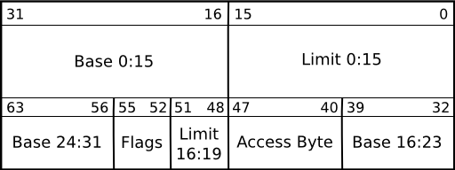

# Chapter 2
## Loading the GDT

The GDT is a table that holds a bunch of descriptors which describe the state of segments and the CPU when the offsets from the start of the GDT to the descriptors are loaded into segments.

It was used in 32 bit mode for segmentation before 64 bit mode came along and made segmentation obsolete, however now in 64 bit mode it is mostly used for controlling CPU permissions like user mode vs. kernel mode.

The GDT should be loaded before you start running anything else, as it will be useful later for permissions and such, so we will load it in the assembly before the kernel is started, although if you wanted to try, you could load the GDT in C instead as part of your kernel's setup in `kmain`. This would also make controlling the parameters perhaps easier to understand, but you can also comment them in assembly.

A very simple example GDT that can be used in long mode looks like this:
```x86asm
section .data

global GDT64

; The GDT (Global descriptor table)
GDT64:
    .Null: equ $ - GDT64
    dq 0
    .Code: equ $ - GDT64
    dw 0
    dw 0
    db 0
    db 10011011b
    db 10101111b
    db 0
    .Data: equ $ - GDT64
    dw 0xFFFF
    dw 0
    db 0
    db 10010011b
    db 11001111b
    db 0
GDT_END:
```
The GDT starts with a null entry, because the offset 0 is used as an invalid descriptor. Each entry is 8 bytes long, and segment registers store offsets into the GDT.

Each GDT descriptor looks like this:



On x86_64, the base is usually 0 and the limit is usually `0xFFFFF`, and the flags tell the CPU more about the descriptor, like if it is a code descriptor or a data descriptor (only code descriptors can be loaded into `cs`). The access byte tells the CPU about permissions for that descriptor, and also controls user mode vs kernel mode, along with the other permission rings that exist on x86.

You can load descriptors into most segment registers by just storing the offset into them, but for the `cs` segment register, you need to do something like far jump or `iretq`. In long mode you cannot far jump, so we will `iretq` to reload `cs`.

When a segment register is reloaded with a new value, it reads from that GDT offset and puts the descriptor stored at the offset into a hidden part of the segment register, along with setting any CPU modes or chaging permission rings.

Now that we have the GDT structure, we need to actually load the GDT.

To load the GDT, you use the `lgdt` instruction. The instruction takes a memory operand, which points to a structure describing the GDT.

The structure looks like this:
```x86asm
; Remember to put this in the data section as well, so you can put it in right under the GDT, before changing sections

GDT_PTR:
    dw GDT_END - GDT64 - 1    ; Limit
    dq GDT64                  ; Base
```
Now, about using `iretq`, it is a variant of `ret`, in that it pops from the stack to return somewhere, but it pops 5 things off the stack instead of 1, and it is normally used for returning from interrupts. The registers it pops into are these, in the order it pops: `rip`, `cs`, `rflags`, `rsp`, and `ss`.

So we need to push the values we want those registers to be onto the stack.

We can set `rip` to point to another label, we can set `cs` to be `0x8`, since that is the offset of the kernel's (we will add user descriptors later) code segment into the GDT, because of the null descriptor, for `rflags` we can use `pushf`, and for `rsp` we can just push it, and we can set `ss` to the offset of the data descriptor, or `0x10`.

We finally need to set all the other segment registers to the data descriptor offset, even though the CPU won't use them.

So, with the knowledge above, you can change your `exec_start` to something like this (remember to keep the external reference to kmain):
```x86asm
exec_start:
    lgdt [GDT_PTR]

    ; Push the values for iretq
    push 0x10       ; ss
    push rsp        ; rsp
    pushf           ; rflags
    push 0x8        ; cs
    push run_kernel ; rip
    
run_kernel:
    mov ax, 0x10 ; We can't write to the segment registers directly

    mov ds, ax
    mov es, ax
    mov ss, ax
    mov gs, ax
    mov fs, ax

    ; Run the kernel
    call kmain

    ; Halt if kmain returns
    cli
    hlt
```

And now the GDT should be loaded! :)

-[Back to the start](../README.md)-